# Architettura del Sistema Multi-Agente

## Indice
- [Panoramica Architetturale](#panoramica-architetturale)
- [Pattern Architetturali](#pattern-architetturali)
- [Componenti Core](#componenti-core)
- [Flussi di Esecuzione](#flussi-di-esecuzione)
- [Integrazione tra Componenti](#integrazione-tra-componenti)

## Panoramica Architetturale

Il sistema è organizzato in 6 layer principali:

```
┌─────────────────────────────────────────────────────────────┐
│                     APPLICATION LAYER                        │
│  ┌──────────────┐  ┌──────────────┐  ┌──────────────┐      │
│  │ CLI/Scripts  │  │   Examples   │  │   Workflows  │      │
│  └──────────────┘  └──────────────┘  └──────────────┘      │
└─────────────────────────────────────────────────────────────┘
                              │
┌─────────────────────────────────────────────────────────────┐
│                     WORKFLOW LAYER                           │
│  ┌──────────────────────────────────────────────────────┐   │
│  │           Workflow Engine (YAML)                     │   │
│  │  • Load/Validate  • Execute  • Parameter Subst.     │   │
│  └──────────────────────────────────────────────────────┘   │
└─────────────────────────────────────────────────────────────┘
                              │
┌─────────────────────────────────────────────────────────────┐
│                   ORCHESTRATION LAYER                        │
│  ┌──────────────┐  ┌──────────────┐  ┌──────────────┐      │
│  │ Orchestrator │  │  Task Queue  │  │   Dep Graph  │      │
│  └──────────────┘  └──────────────┘  └──────────────┘      │
│  ┌──────────────┐  ┌──────────────┐                         │
│  │Agent Registry│  │Result Aggreg.│                         │
│  └──────────────┘  └──────────────┘                         │
└─────────────────────────────────────────────────────────────┘
                              │
┌─────────────────────────────────────────────────────────────┐
│                  COMMUNICATION LAYER                         │
│  ┌──────────────────────────────────────────────────────┐   │
│  │ Message Bus (Pub/Sub)  │  Shared Memory (Blackboard)│   │
│  └──────────────────────────────────────────────────────┘   │
└─────────────────────────────────────────────────────────────┘
                              │
┌─────────────────────────────────────────────────────────────┐
│                      AGENT LAYER                             │
│  ┌────────┐ ┌────────┐ ┌────────┐ ┌────────┐ ┌──────────┐ │
│  │Coordin.│ │Research│ │Analyst │ │ Writer │ │FactCheck │ │
│  └────────┘ └────────┘ └────────┘ └────────┘ └──────────┘ │
└─────────────────────────────────────────────────────────────┘
                              │
┌─────────────────────────────────────────────────────────────┐
│                       LLM LAYER                              │
│  ┌──────────────┐  ┌──────────────┐  ┌──────────────┐      │
│  │Ollama (Local)│  │  Groq (Fast) │  │ OpenAI (GPT) │      │
│  └──────────────┘  └──────────────┘  └──────────────┘      │
└─────────────────────────────────────────────────────────────┘
```

## Pattern Architetturali

### 1. Message Bus Pattern (Publish-Subscribe)

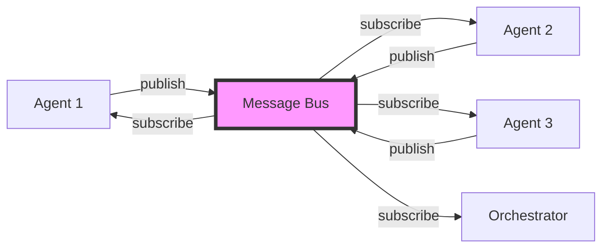

**Vantaggi**:
- Disaccoppiamento tra agenti
- Comunicazione asincrona
- Scalabilità
- Flessibilità

**Implementazione**:
```python
class MessageBus:
    def __init__(self):
        self.queues = {}  # agent_id -> Queue
        self.subscriptions = {}  # msg_type -> [agent_ids]

    def send(self, message: Message):
        """Invia messaggio a destinatario specifico"""
        self.queues[message.receiver].put(message)

    def broadcast(self, message: Message):
        """Broadcast a tutti i subscriber"""
        for agent_id in self.subscriptions[message.msg_type]:
            self.send(message)
```

### 2. Blackboard Pattern (Shared Memory)

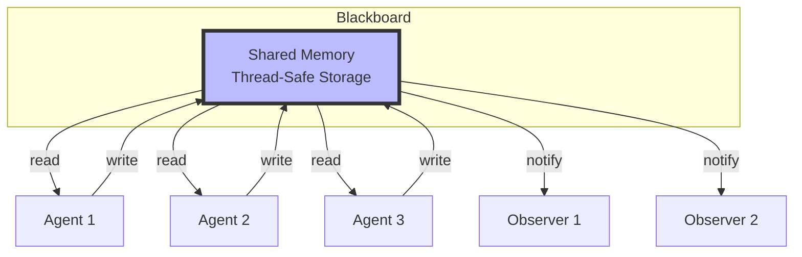

**Caratteristiche**:
- Memoria condivisa thread-safe
- Versioning automatico
- Observer notifications
- Lock per-key per concurrency

**Implementazione**:
```python
class SharedMemory:
    def __init__(self):
        self.data = {}
        self.observers = defaultdict(list)
        self._lock = RLock()
        self._key_locks = defaultdict(RLock)

    def write(self, key: str, value: Any, agent_id: str):
        with self._key_locks[key]:
            entry = MemoryEntry(value, agent_id, version)
            self.data[key] = entry
            self._notify_observers(key, entry)
```

### 3. DAG Pattern (Directed Acyclic Graph)

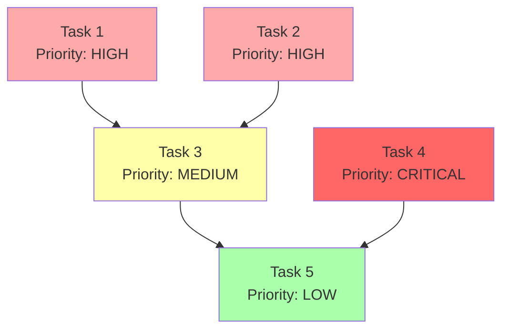

**Layer Execution**:
```
Layer 1: [Task 1, Task 2, Task 4]  ← Esecuzione parallela
Layer 2: [Task 3]                   ← Dipende da T1, T2
Layer 3: [Task 5]                   ← Dipende da T3, T4
```

## Componenti Core

### Orchestrator - Flusso Completo

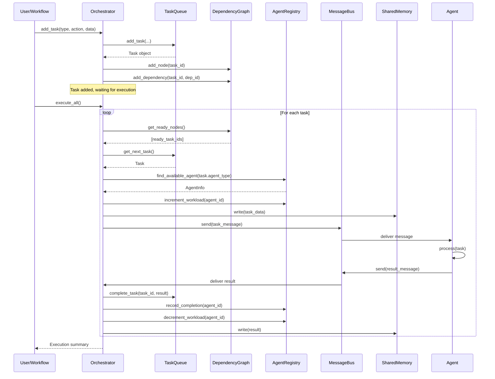

### Task Queue - Priorità e Dipendenze

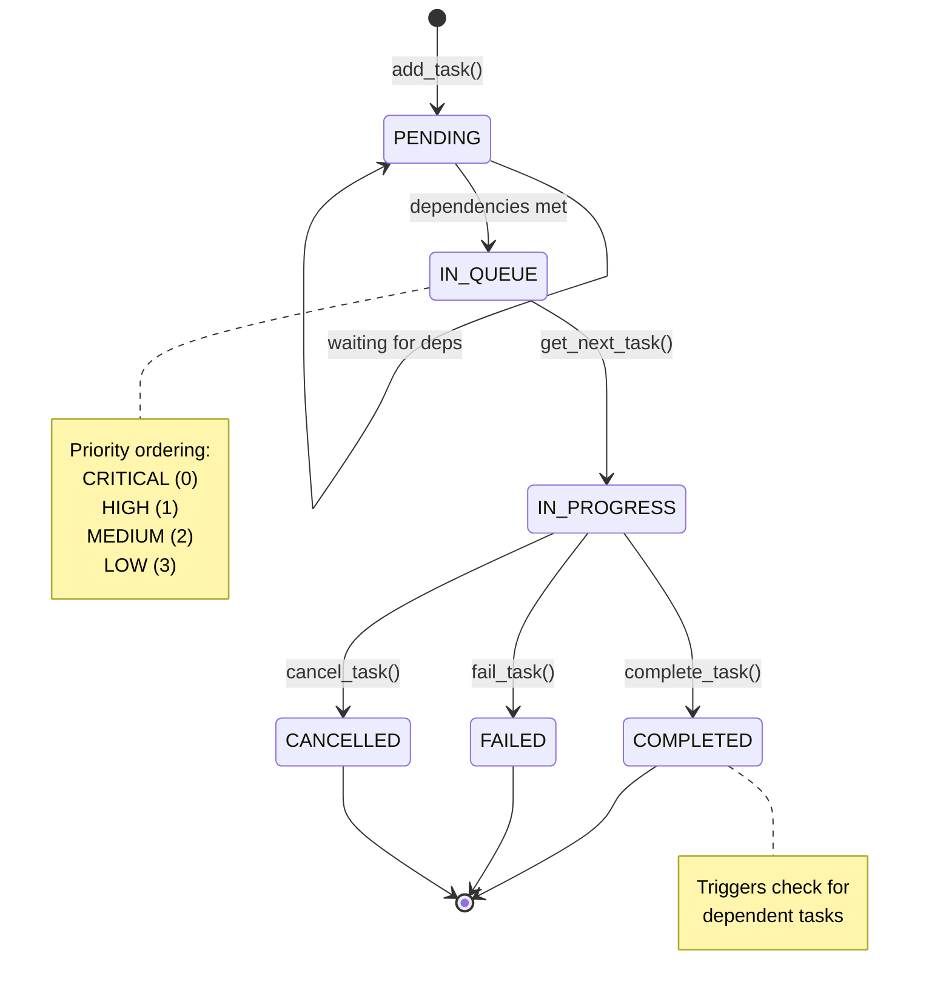

**Priority Queue Implementation**:
```python
# Task è un @dataclass con order=True
@dataclass(order=True)
class Task:
    priority: int = field(compare=True)  # Solo priority per ordering
    task_id: str = field(compare=False)
    # ... altri campi

# PriorityQueue automaticamente ordina per priority
queue = PriorityQueue()
queue.put(task)  # Auto-sorted
```

### Dependency Graph - Algoritmi

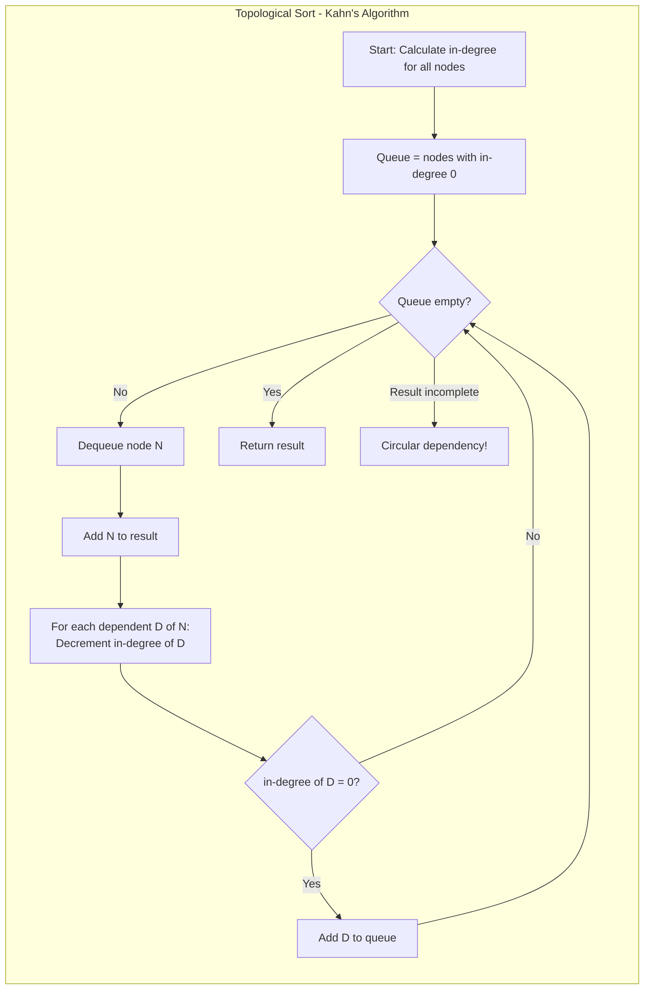

**Execution Layers Algorithm**:
```python
def get_execution_layers(self) -> List[List[str]]:
    layers = []
    completed = set()
    remaining = self.nodes.copy()

    while remaining:
        # Trova nodi eseguibili ora
        ready = [
            node for node in remaining
            if self.can_execute(node, completed)
        ]

        if not ready:
            raise CircularDependencyError()

        layers.append(ready)  # Tutti in ready possono essere paralleli
        completed.update(ready)
        remaining -= set(ready)

    return layers
```

### Agent Registry - Load Balancing

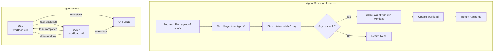

**Workload Tracking**:
```python
@dataclass
class AgentInfo:
    workload: int = 0
    total_tasks_completed: int = 0
    total_tasks_failed: int = 0

    def get_success_rate(self) -> float:
        total = self.total_tasks_completed + self.total_tasks_failed
        return self.total_tasks_completed / total if total > 0 else 0.0

# Load balancing
def find_available_agent(self, agent_type: str) -> Optional[AgentInfo]:
    candidates = self.find_by_type(agent_type)
    candidates = [a for a in candidates if a.status in ["idle", "busy"]]
    return min(candidates, key=lambda a: a.workload)  # Least loaded
```

### Result Aggregator - Strategie

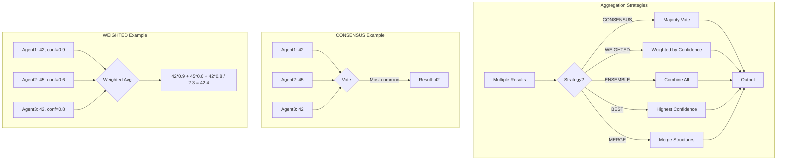

**Strategy Implementation**:
```python
class AggregationStrategy(Enum):
    CONSENSUS = "consensus"  # Majority vote
    WEIGHTED = "weighted"    # Weighted by confidence
    ENSEMBLE = "ensemble"    # All results
    BEST = "best"           # Highest confidence
    MERGE = "merge"         # Merge dicts/lists

def aggregate(self, results: List[AgentResult], strategy: AggregationStrategy):
    if strategy == AggregationStrategy.CONSENSUS:
        return self._consensus(results)  # Counter for majority
    elif strategy == AggregationStrategy.WEIGHTED:
        return self._weighted(results)   # Weighted average
    # ...
```

### Workflow Engine - Parameter Substitution

```mermaid
graph TB
    subgraph "Workflow Execution Flow"
        W1[Load YAML] --> W2[Validate Structure]
        W2 --> W3[Merge Parameters<br/>defaults + user]
        W3 --> W4{For each step}

        W4 --> W5[Substitute Parameters<br/>{{ parameters.X }}]
        W5 --> W6[Substitute Step Results<br/>{{ steps.Y.output }}]
        W6 --> W7[Add Task to Orchestrator]
        W7 --> W4

        W4 -->|All steps added| W8[Execute via Orchestrator]
        W8 --> W9[Collect Results]
        W9 --> W10[Build Output<br/>apply output template]
        W10 --> W11[Return Result]
    end
```

**Parameter Substitution Process**:
```yaml
# YAML Definition
parameters:
  topic: "AI"
  depth: "deep"

steps:
  - id: research
    params:
      topic: "{{ parameters.topic }}"     # → "AI"
      depth: "{{ parameters.depth }}"     # → "deep"

  - id: analyze
    input: "{{ steps.research.output }}"  # → Result from research step

output:
  report: "{{ steps.analyze.output }}"   # → Result from analyze step
```

**Substitution Algorithm**:
```python
def _substitute_params(self, config: Dict[str, Any]) -> Dict[str, Any]:
    import re, json

    config_str = json.dumps(config)

    def replace_param(match):
        path = match.group(1).strip()

        if path.startswith('parameters.'):
            name = path[len('parameters.'):]
            return str(self.execution_context['parameters'][name])

        elif path.startswith('steps.'):
            parts = path[len('steps.'):].split('.')
            step_id, field = parts[0], '.'.join(parts[1:])
            return str(self.execution_context['steps'][step_id][field])

        return match.group(0)

    # Regex: {{ ... }}
    config_str = re.sub(r'\{\{\s*([^}]+)\s*\}\}', replace_param, config_str)

    return json.loads(config_str)
```

## Integrazione tra Componenti

### Workflow Engine + Orchestrator Integration

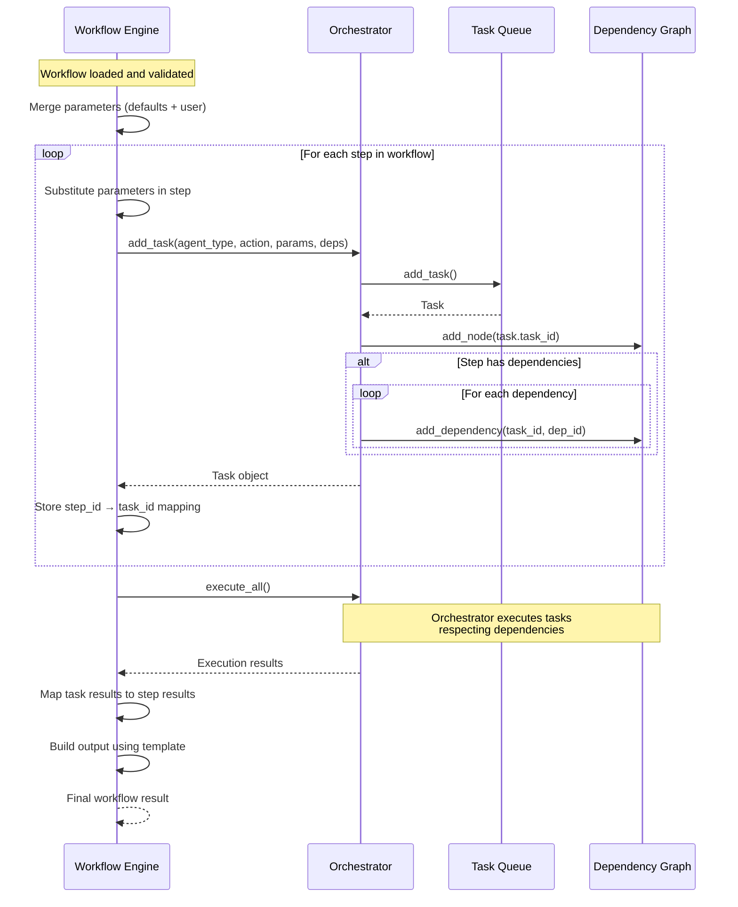

### Multi-Agent Collaboration Pattern

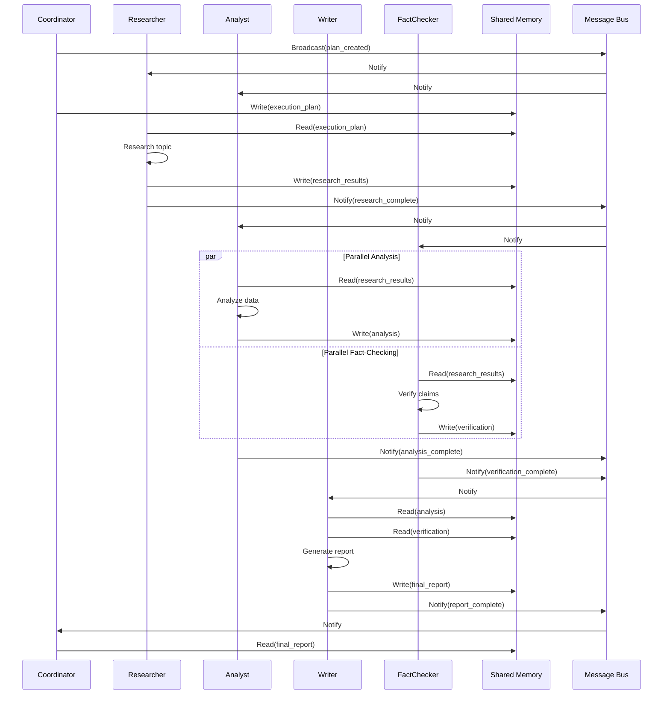

## Performance e Scalabilità

### Thread Safety

Tutti i componenti core sono thread-safe:

```python
# MessageBus - Queue per agent
self.queues[agent_id] = Queue()  # Thread-safe queue

# SharedMemory - RLock
with self._lock:  # Global lock
    with self._key_locks[key]:  # Per-key lock
        self.data[key] = value

# TaskQueue - PriorityQueue
self.queue = PriorityQueue()  # Thread-safe

# AgentRegistry - No shared mutable state issues
# (operazioni atomiche su dict built-in)
```

### Parallelismo

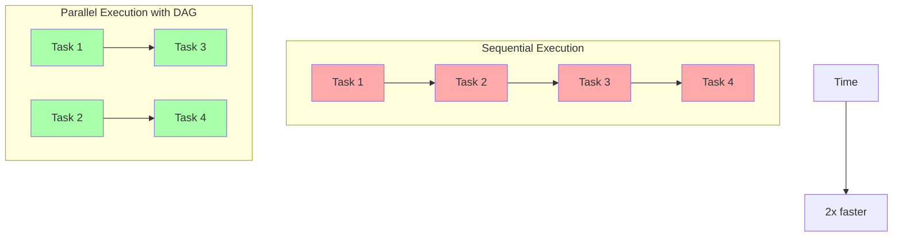

### Scalabilità Orizzontale

```
┌─────────────────────────────────────┐
│         Load Balancer               │
└─────────────────────────────────────┘
           │
    ┌──────┴──────┬──────────┐
    │             │          │
┌───▼───┐    ┌───▼───┐  ┌───▼───┐
│Agent 1│    │Agent 2│  │Agent 3│
│Res.   │    │Res.   │  │Res.   │
│Work=2 │    │Work=0 │  │Work=5 │
└───────┘    └───────┘  └───────┘
                │
        Agent 2 selected (min workload)
```

## Conclusione

L'architettura del sistema è progettata per:
- **Modularità**: Ogni componente ha responsabilità ben definite
- **Scalabilità**: Load balancing e esecuzione parallela
- **Flessibilità**: Pattern configurabili e estensibili
- **Robustezza**: Thread-safety e error handling
- **Osservabilità**: Statistiche e monitoring integrate

Per approfondimenti:
- [System Overview](SYSTEM_OVERVIEW.md)
- [Workflow Guide](WORKFLOW_GUIDE.md)
- [API Reference](API_REFERENCE.md)
