# Diagrammi di Flusso - Sistema Multi-Agente

Questa documentazione contiene diagrammi di flusso dettagliati per visualizzare i processi principali del sistema.

## Indice
- [Workflow Execution Flow](#workflow-execution-flow)
- [Task Lifecycle](#task-lifecycle)
- [Agent Communication](#agent-communication)
- [Dependency Resolution](#dependency-resolution)
- [Result Aggregation](#result-aggregation)

---

## Workflow Execution Flow

### Flusso Completo di Esecuzione Workflow

```mermaid
flowchart TD
    Start([User Executes Workflow]) --> LoadYAML[Load YAML File]
    LoadYAML --> ParseYAML{Parse YAML}

    ParseYAML -->|Invalid| Error1[Throw ValidationError]
    ParseYAML -->|Valid| ValidateStructure[Validate Structure]

    ValidateStructure --> CheckFields{All Required<br/>Fields Present?}
    CheckFields -->|No| Error2[Throw ValidationError]
    CheckFields -->|Yes| CheckDeps{Valid<br/>Dependencies?}

    CheckDeps -->|No| Error3[Throw ValidationError]
    CheckDeps -->|Yes| MergeParams[Merge Parameters<br/>defaults + user]

    MergeParams --> CreateContext[Create Execution Context]
    CreateContext --> LoopSteps{For Each Step}

    LoopSteps --> SubstParams[Substitute Parameters<br/>{{ parameters.X }}]
    SubstParams --> SubstSteps[Substitute Step Results<br/>{{ steps.Y.output }}]
    SubstSteps --> AddTask[Add Task to Orchestrator]
    AddTask --> StoreMapping[Store step_id → task_id]
    StoreMapping --> MoreSteps{More Steps?}

    MoreSteps -->|Yes| LoopSteps
    MoreSteps -->|No| ExecuteAll[Execute All Tasks<br/>via Orchestrator]

    ExecuteAll --> CheckStatus{All Tasks<br/>Completed?}
    CheckStatus -->|No| ExecuteFailed[Mark as Failed]
    CheckStatus -->|Yes| MapResults[Map task results<br/>to step results]

    MapResults --> BuildOutput[Build Output<br/>using template]
    BuildOutput --> FinalResult[Return Workflow Result]

    ExecuteFailed --> End1([End - Failed])
    FinalResult --> End2([End - Success])
    Error1 --> End3([End - Error])
    Error2 --> End3
    Error3 --> End3

    style Start fill:#90EE90
    style End1 fill:#FF6B6B
    style End2 fill:#90EE90
    style End3 fill:#FF6B6B
    style ExecuteAll fill:#FFD700
```

### Workflow Parameter Substitution

```mermaid
flowchart LR
    subgraph Input
        YAML[YAML Config<br/>with {{ ... }}]
        UserParams[User Parameters]
        StepResults[Previous Step Results]
    end

    subgraph Processing
        Parse[Parse to JSON]
        Regex[Find {{ ... }} patterns]
        Resolve{Pattern Type?}

        Resolve -->|parameters.*| GetParam[Get from parameters]
        Resolve -->|steps.*.output| GetStep[Get from step results]

        GetParam --> Replace[Replace in JSON]
        GetStep --> Replace

        Replace --> More{More Patterns?}
        More -->|Yes| Regex
        More -->|No| Rebuild[Rebuild Config]
    end

    subgraph Output
        Final[Final Configuration]
    end

    YAML --> Parse
    UserParams --> GetParam
    StepResults --> GetStep
    Parse --> Regex
    Rebuild --> Final

    style Parse fill:#FFE4B5
    style Final fill:#90EE90
```

---

## Task Lifecycle

### Complete Task Lifecycle

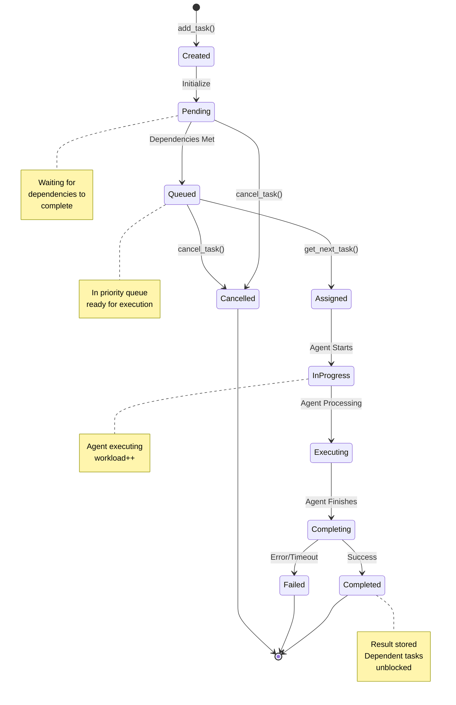

### Task State Transitions Detail

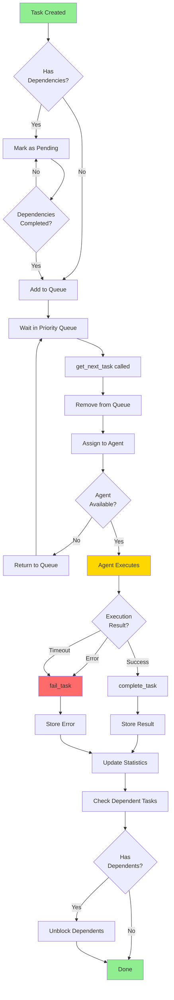

---

## Agent Communication

### Message Bus Communication Pattern

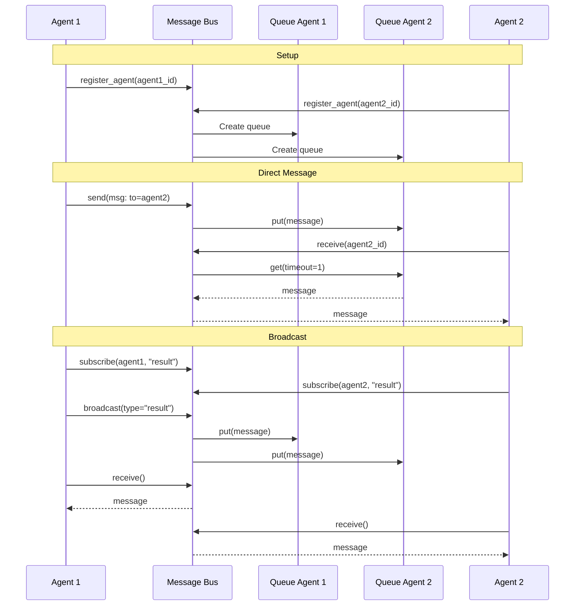

### Shared Memory Access Pattern

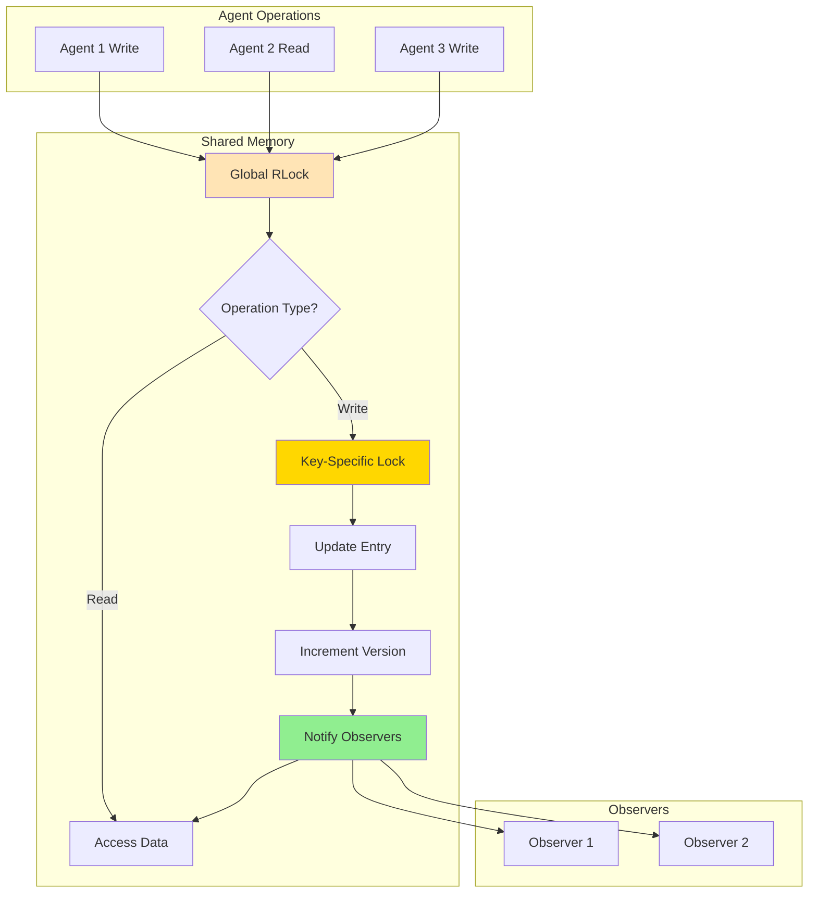

---

## Dependency Resolution

### Topological Sort (Kahn's Algorithm)

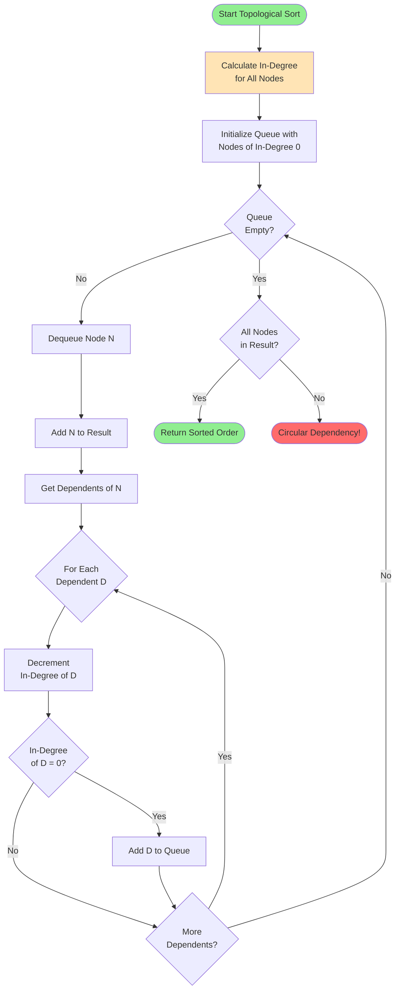

### Execution Layers Generation

```mermaid
flowchart TD
    Start([Generate Execution Layers]) --> Init[Initialize:<br/>layers = []<br/>completed = {}<br/>remaining = all nodes]

    Init --> Check{Remaining<br/>Nodes?}

    Check -->|No| Return([Return Layers])
    Check -->|Yes| FindReady[Find Ready Nodes<br/>can_execute(node, completed)]

    FindReady --> CheckReady{Found<br/>Ready Nodes?}

    CheckReady -->|No| Error([Circular Dependency!])
    CheckReady -->|Yes| CreateLayer[Create New Layer<br/>with Ready Nodes]

    CreateLayer --> UpdateCompleted[Update completed<br/>with ready nodes]
    UpdateCompleted --> UpdateRemaining[Remove ready nodes<br/>from remaining]

    UpdateRemaining --> Check

    style Start fill:#90EE90
    style Return fill:#90EE90
    style Error fill:#FF6B6B
    style CreateLayer fill:#FFD700

    Note1[Layer 1: A, B<br/>can execute in parallel]
    Note2[Layer 2: C, D<br/>wait for layer 1]

    CreateLayer -.-> Note1
    UpdateCompleted -.-> Note2
```

### Dependency Graph Example

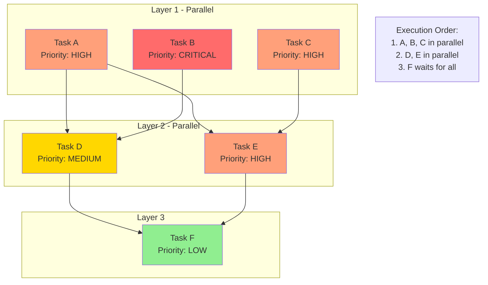

---

## Result Aggregation

### Aggregation Strategy Selection

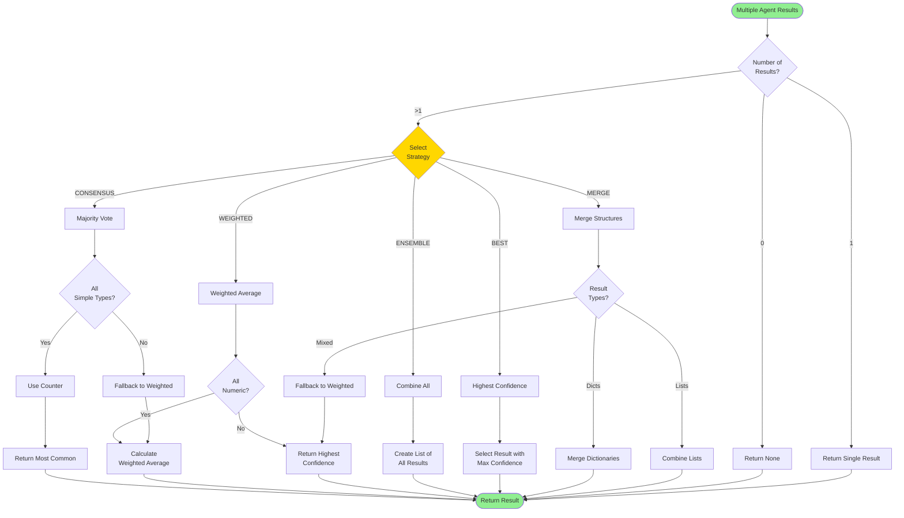

### Consensus Aggregation Example

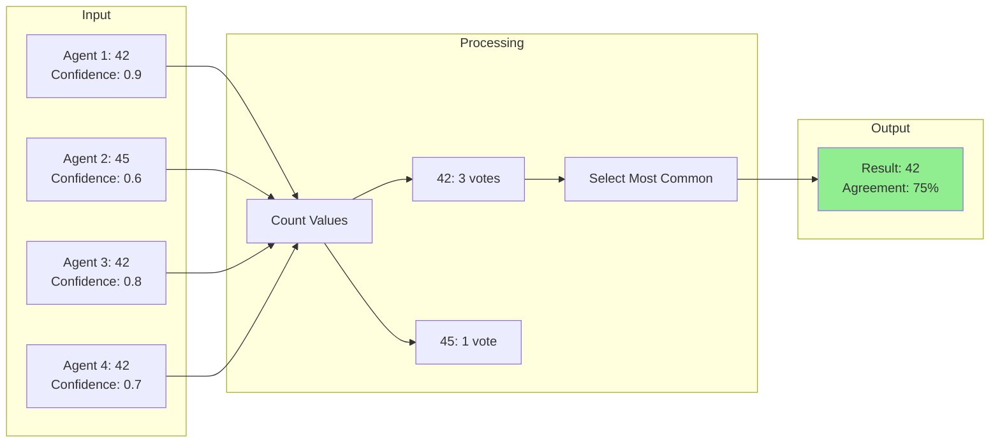

### Weighted Aggregation Example

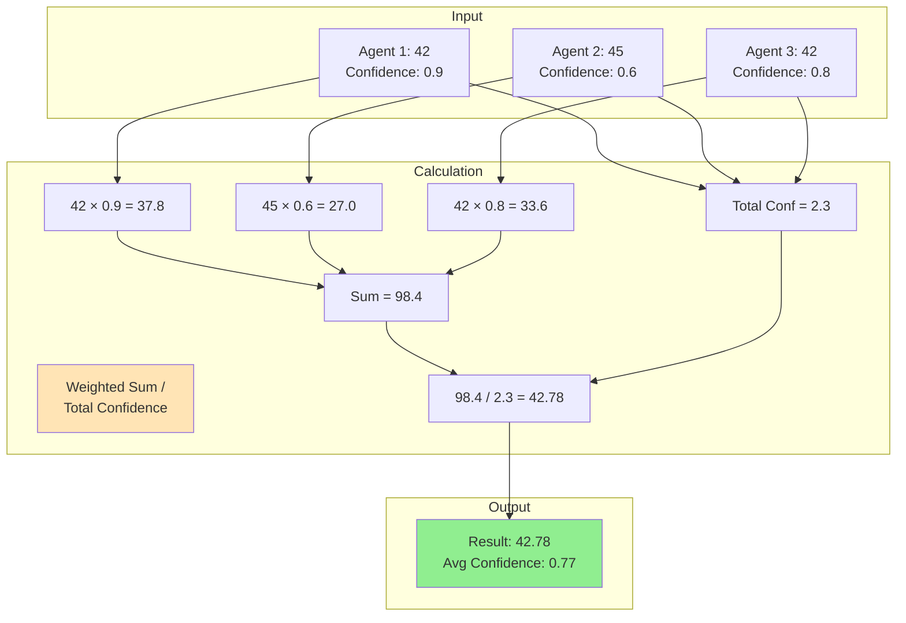

---

## Agent Load Balancing

### Load Balancing Selection

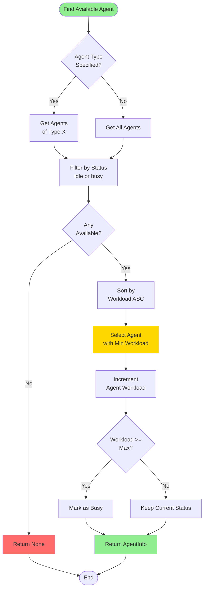

### Load Distribution Example

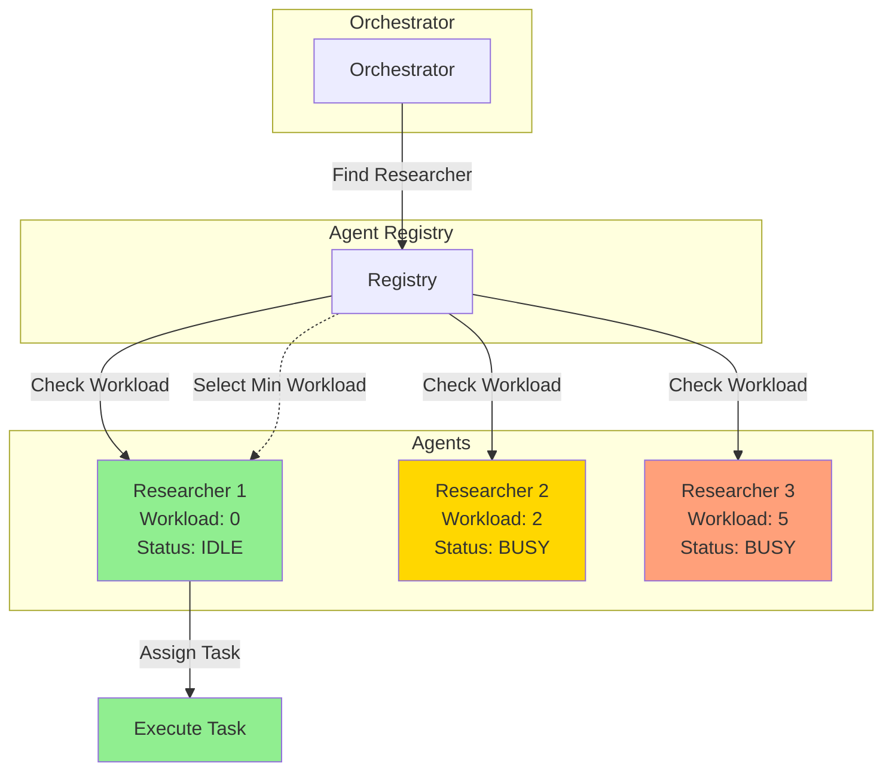

---

## Complete System Flow

### End-to-End Workflow Execution

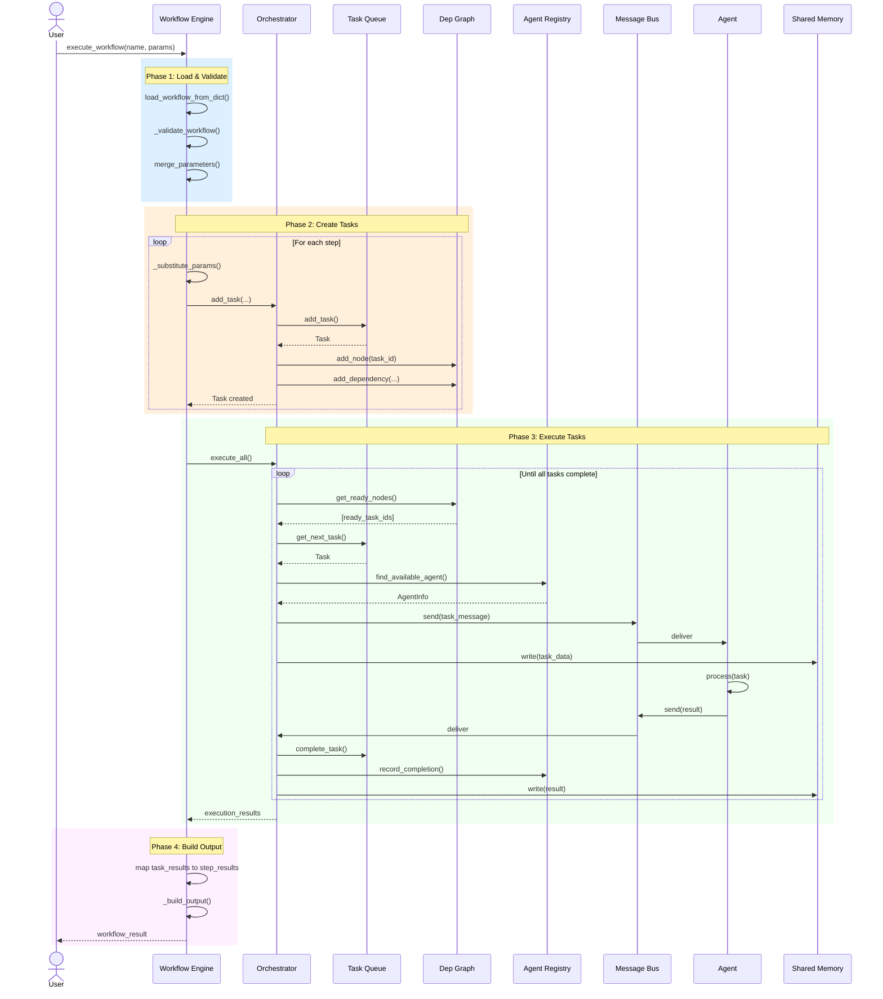

---

## Riferimenti

- [System Overview](SYSTEM_OVERVIEW.md)
- [Architecture](ARCHITECTURE.md)
- [Workflow Guide](WORKFLOW_GUIDE.md)
- [API Reference](API_REFERENCE.md)
- [Examples](EXAMPLES.md)

---

**Note**: Tutti i diagrammi sono in formato Mermaid e possono essere visualizzati in qualsiasi editor che supporti Mermaid (GitHub, GitLab, VSCode con plugin, ecc.).
