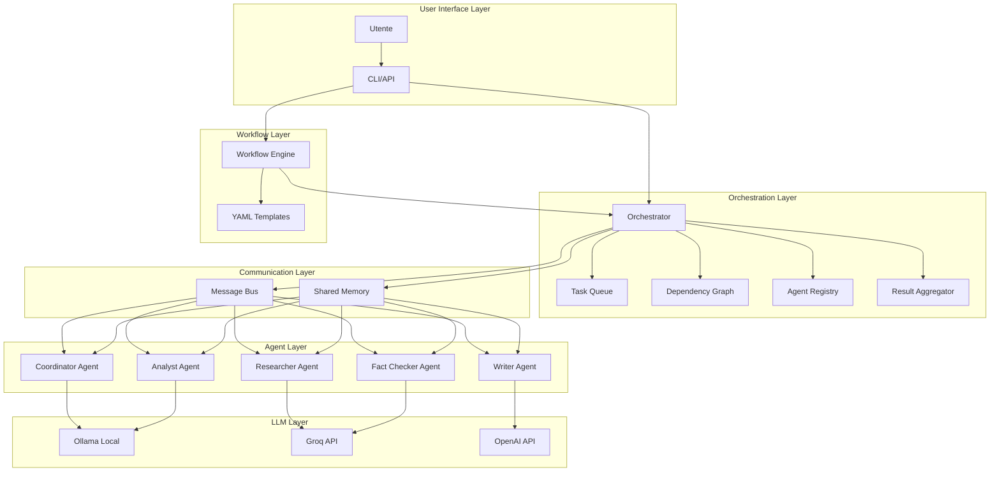
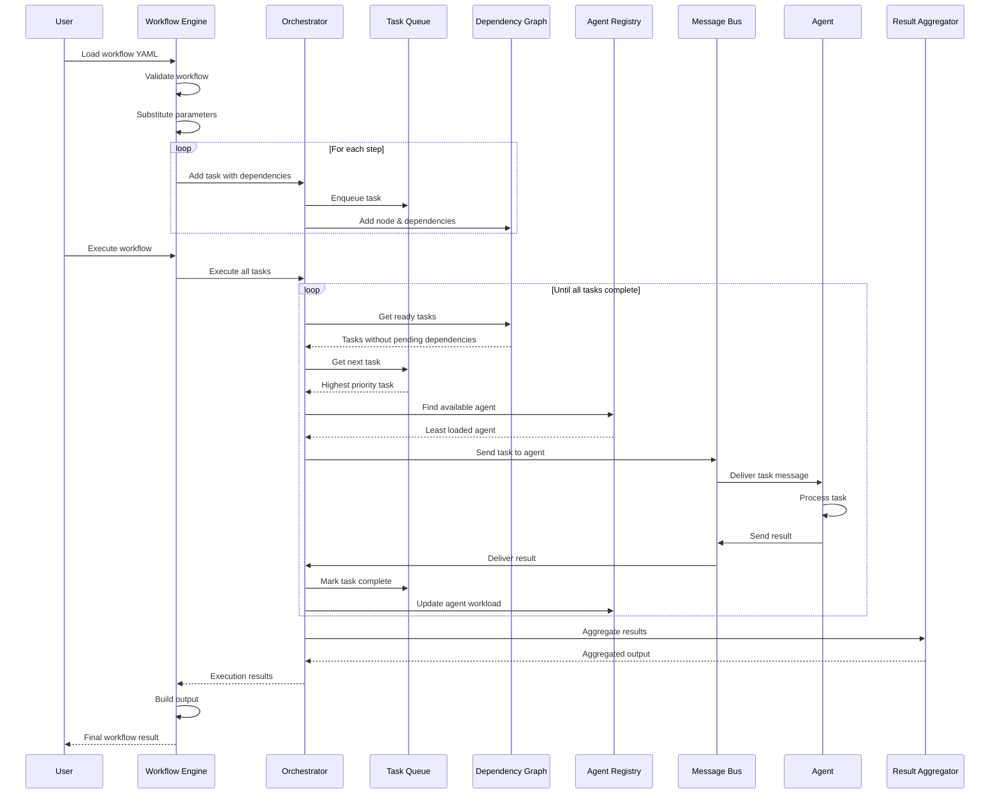

# Sistema Multi-Agente - Panoramica Generale

## Indice
- [Introduzione](#introduzione)
- [Architettura del Sistema](#architettura-del-sistema)
- [Componenti Principali](#componenti-principali)
- [Fasi di Sviluppo](#fasi-di-sviluppo)
- [Flusso di Esecuzione](#flusso-di-esecuzione)

## Introduzione

Il Sistema Multi-Agente è un framework avanzato per l'orchestrazione di agenti AI specializzati che collaborano per completare task complessi. Il sistema implementa pattern architetturali come Message Bus, Blackboard, e DAG per gestire comunicazione, memoria condivisa e dipendenze.

### Caratteristiche Principali

- **Multi-LLM Support**: Supporto per Ollama (locale), Groq, e OpenAI
- **Agenti Specializzati**: 5 agenti con responsabilità specifiche
- **Orchestrazione Avanzata**: Gestione priorità, dipendenze, load balancing
- **Workflow YAML**: Definizione dichiarativa di workflow complessi
- **Scalabilità**: Esecuzione parallela e distribuzione del carico

## Architettura del Sistema



## Componenti Principali

### 1. Orchestrator (core/orchestrator.py)
**Responsabilità**: Coordinatore centrale del sistema
- Gestione del ciclo di vita dei task
- Assignment intelligente degli agenti
- Monitoraggio dello stato del sistema
- Integrazione di tutti i componenti core

### 2. Task Queue (core/task_queue.py)
**Responsabilità**: Gestione code con priorità
- Scheduling basato su priorità (CRITICAL, HIGH, MEDIUM, LOW)
- Tracking dello stato dei task
- Gestione dipendenze
- Statistiche e monitoring

### 3. Dependency Graph (core/dependency_graph.py)
**Responsabilità**: Gestione dipendenze tra task
- DAG (Directed Acyclic Graph)
- Topological sorting per ordine esecuzione
- Rilevamento dipendenze circolari
- Execution layers per parallelismo

### 4. Agent Registry (core/agent_registry.py)
**Responsabilità**: Registro e discovery agenti
- Registrazione/deregistrazione agenti
- Discovery per tipo e capabilities
- Load balancing automatico
- Success rate tracking

### 5. Result Aggregator (core/result_aggregator.py)
**Responsabilità**: Aggregazione risultati
- Strategie: CONSENSUS, WEIGHTED, ENSEMBLE, BEST, MERGE
- Analisi di agreement
- Weighted averaging
- Numeric/list/dict aggregation

### 6. Workflow Engine (core/workflow_engine.py)
**Responsabilità**: Esecuzione workflow YAML
- Caricamento e validazione workflow
- Parameter substitution `{{ parameters.name }}`
- Integrazione con Orchestrator
- Output building

### 7. Message Bus (core/message_bus.py)
**Responsabilità**: Comunicazione inter-agente
- Publish-subscribe pattern
- Message routing
- Broadcasting
- Thread-safe queues

### 8. Shared Memory (core/shared_memory.py)
**Responsabilità**: Memoria condivisa
- Blackboard pattern
- Versioning dei dati
- Observer notifications
- Thread-safe access

## Fasi di Sviluppo

### Fase 1: Setup e Fondamenta ✅
- Configurazione sistema (Pydantic)
- BaseAgent e Message classes
- MessageBus per comunicazione
- SharedMemory (Blackboard pattern)

### Fase 2: Agenti Specializzati ✅
- Interfaccia LLM unificata (Ollama, Groq, OpenAI)
- 5 agenti specializzati:
  - **CoordinatorAgent**: Orchestrazione e planning
  - **ResearcherAgent**: Ricerca e raccolta informazioni
  - **AnalystAgent**: Analisi e insights
  - **WriterAgent**: Generazione report
  - **FactCheckerAgent**: Verifica e validazione

### Fase 3: Sistema di Orchestrazione ✅
- TaskQueue con priorità
- DependencyGraph (DAG)
- AgentRegistry con load balancing
- ResultAggregator con strategie multiple
- Orchestrator centrale

### Fase 4: Workflow Engine ✅
- Workflow YAML support
- Parameter substitution
- Template predefiniti:
  - `quick_analysis.yaml`: Analisi rapida
  - `deep_research.yaml`: Ricerca approfondita
  - `parallel_research.yaml`: Ricerca parallela
- Validazione e error handling

## Flusso di Esecuzione



## Esempio di Utilizzo

### 1. Workflow YAML Semplice

```yaml
name: "Simple Analysis"
description: "Quick analysis workflow"
version: "1.0"

parameters:
  topic: "AI Trends"
  depth: "medium"

steps:
  - id: research
    agent_type: Researcher
    action: research
    params:
      topic: "{{ parameters.topic }}"
      depth: "{{ parameters.depth }}"
    priority: high

  - id: analyze
    agent_type: Analyst
    action: analyze
    depends_on: [research]
    input: "{{ steps.research.output }}"
    priority: medium

  - id: report
    agent_type: Writer
    action: write
    depends_on: [analyze]
    params:
      content: "{{ steps.analyze.output }}"
      style: "professional"
    priority: medium

output:
  final_report: "{{ steps.report.output }}"
  analysis: "{{ steps.analyze.output }}"
```

### 2. Esecuzione Programmatica

```python
from core.workflow_engine import WorkflowEngine
from core.orchestrator import Orchestrator

# Setup
orchestrator = Orchestrator()
engine = WorkflowEngine(orchestrator)

# Register agents
# ... (vedi esempi completi)

# Load e execute workflow
engine.load_workflow("workflows/simple_analysis.yaml")
result = engine.execute_workflow(
    "Simple Analysis",
    parameters={"topic": "Quantum Computing"}
)

print(result['output']['final_report'])
```

## Metriche e Monitoraggio

Il sistema fornisce statistiche dettagliate:

### Task Queue Statistics
- Total tasks, completed, failed, cancelled
- Success rate
- Pending/in-progress counts

### Agent Registry Statistics
- Total agents, idle, busy, offline
- Success rate per agente
- Total tasks processed

### Dependency Graph Statistics
- Total nodes/edges
- Nodes without dependencies/dependents
- Execution layers

### Workflow Execution
- Execution time
- Step results
- Parameter substitution
- Output building

## Prossimi Passi

- **Fase 5**: Monitoring e Logging avanzato
- **Fase 6**: Persistenza e State Management
- **Fase 7**: API REST/GraphQL
- **Fase 8**: UI Dashboard
- **Fase 9**: Distributed Execution
- **Fase 10**: Advanced ML Features

## Riferimenti

- [Architettura Dettagliata](ARCHITECTURE.md)
- [Guida ai Workflow](WORKFLOW_GUIDE.md)
- [API Reference](API_REFERENCE.md)
- [Esempi Pratici](EXAMPLES.md)
