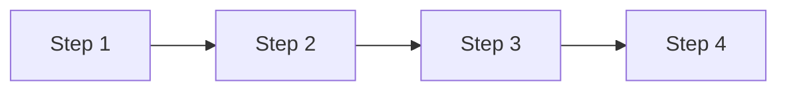
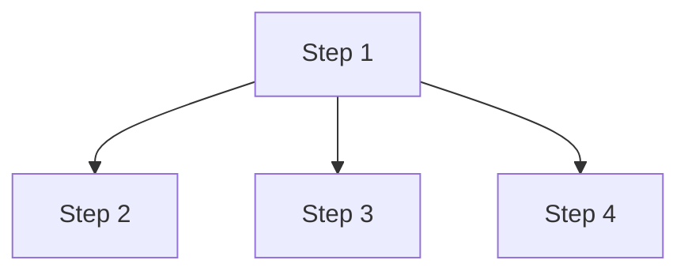
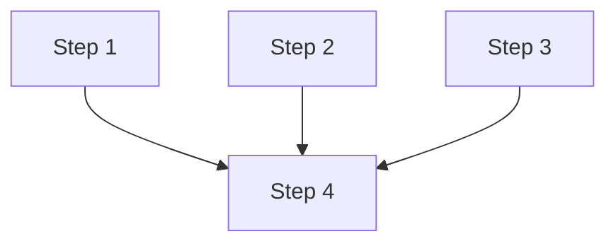
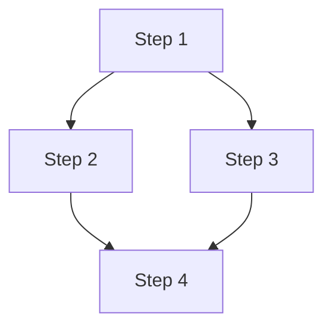
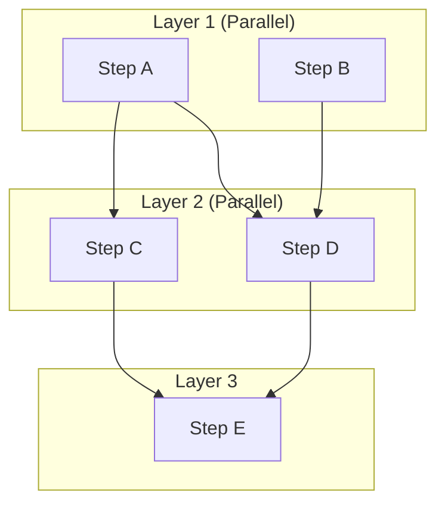

# Guida ai Workflow - Sistema Multi-Agente

## Indice
- [Introduzione](#introduzione)
- [Struttura Workflow YAML](#struttura-workflow-yaml)
- [Parameter Substitution](#parameter-substitution)
- [Gestione Dipendenze](#gestione-dipendenze)
- [Template Predefiniti](#template-predefiniti)
- [Esempi Pratici](#esempi-pratici)
- [Best Practices](#best-practices)

## Introduzione

I workflow permettono di definire in modo dichiarativo sequenze complesse di operazioni multi-agente. Ogni workflow è un file YAML che specifica:
- Agenti da utilizzare
- Azioni da eseguire
- Dipendenze tra step
- Parametri configurabili
- Output desiderato

### Vantaggi dei Workflow YAML

✅ **Dichiarativo**: Descrivi cosa vuoi, non come ottenerlo
✅ **Riutilizzabile**: Template parametrizzati per diversi scenari
✅ **Manutenibile**: Struttura chiara e leggibile
✅ **Versionabile**: File testuali tracciabili con Git
✅ **Validabile**: Schema definito e validazione automatica

## Struttura Workflow YAML

### Schema Completo

```yaml
# METADATA
name: "Workflow Name"              # Required: Nome workflow
description: "Workflow description"  # Optional: Descrizione
version: "1.0"                      # Optional: Versione (default "1.0")

# PARAMETERS
parameters:                         # Optional: Parametri con valori default
  param1: "default_value"
  param2: 42
  param3: true

# STEPS
steps:                              # Required: Lista di step
  - id: step_id                     # Required: Identificatore univoco
    agent_type: AgentType           # Required: Tipo di agente
    action: action_name             # Required: Azione da eseguire

    # Optional fields
    params:                         # Parametri per l'azione
      key: value
    input: "data"                   # Input esplicito
    depends_on: [step_id, ...]     # Dipendenze
    priority: "high"                # Priorità (critical/high/medium/low)
    timeout: 300                    # Timeout in secondi
    retry: 3                        # Numero di retry
    description: "Step description" # Descrizione

# OUTPUT
output:                             # Optional: Template output
  result_key: "{{ steps.step_id.output }}"
  metadata:
    status: "completed"
```

### Esempio Minimo

```yaml
name: "Simple Workflow"

steps:
  - id: research
    agent_type: Researcher
    action: research

  - id: analyze
    agent_type: Analyst
    action: analyze
    depends_on: [research]
```

### Esempio Completo

```yaml
name: "Complete Research Workflow"
description: "Comprehensive research with analysis and reporting"
version: "2.0"

parameters:
  topic: "Artificial Intelligence"
  depth: "deep"
  max_sources: 10
  report_format: "markdown"
  priority_level: "high"

steps:
  # Step 1: Research
  - id: primary_research
    agent_type: Researcher
    action: research
    params:
      topic: "{{ parameters.topic }}"
      depth: "{{ parameters.depth }}"
      max_sources: "{{ parameters.max_sources }}"
    priority: "{{ parameters.priority_level }}"
    timeout: 300
    retry: 2
    description: "Gather information from multiple sources"

  # Step 2: Parallel Analysis
  - id: data_analysis
    agent_type: Analyst
    action: analyze
    depends_on: [primary_research]
    input: "{{ steps.primary_research.output }}"
    params:
      analysis_type: "comprehensive"
      focus_areas: ["trends", "insights", "implications"]
    priority: "high"
    timeout: 180
    description: "Analyze research findings"

  # Step 3: Fact Checking (parallel to analysis)
  - id: fact_verification
    agent_type: FactChecker
    action: verify
    depends_on: [primary_research]
    input: "{{ steps.primary_research.output }}"
    params:
      verification_level: "strict"
    priority: "high"
    timeout: 200
    description: "Verify claims and sources"

  # Step 4: Report Generation
  - id: report_generation
    agent_type: Writer
    action: write
    depends_on: [data_analysis, fact_verification]
    params:
      content: "{{ steps.data_analysis.output }}"
      verification_data: "{{ steps.fact_verification.output }}"
      format: "{{ parameters.report_format }}"
      style: "professional"
      include_sources: true
    priority: "medium"
    timeout: 120
    description: "Generate comprehensive report"

output:
  final_report: "{{ steps.report_generation.output }}"
  analysis_summary: "{{ steps.data_analysis.output.summary }}"
  verification_status: "{{ steps.fact_verification.output.status }}"
  sources: "{{ steps.primary_research.output.sources }}"
  metadata:
    topic: "{{ parameters.topic }}"
    execution_time: "{{ execution_time }}"
    version: "2.0"
```

## Parameter Substitution

### Sintassi

Il sistema supporta la sostituzione di parametri usando la sintassi `{{ ... }}`:

```yaml
# 1. Parametri workflow
{{ parameters.param_name }}

# 2. Output di step precedenti
{{ steps.step_id.output }}

# 3. Campi specifici dell'output
{{ steps.step_id.output.field_name }}

# 4. Nested fields
{{ steps.step_id.output.nested.field }}
```

### Flusso di Sostituzione

```mermaid
graph LR
    A[Workflow YAML] --> B[Parse & Validate]
    B --> C[Merge Parameters<br/>defaults + user]
    C --> D{For each step}
    D --> E[Substitute {{ parameters.X }}]
    E --> F[Substitute {{ steps.Y.output }}]
    F --> G[Create Task]
    G --> D
    D --> H[Execute Workflow]
    H --> I[Build Output Template]
```

### Esempi di Sostituzione

#### 1. Parametri Semplici

```yaml
parameters:
  topic: "Quantum Computing"
  depth: "medium"

steps:
  - id: research
    params:
      topic: "{{ parameters.topic }}"      # → "Quantum Computing"
      depth: "{{ parameters.depth }}"      # → "medium"
```

#### 2. Chain di Step

```yaml
steps:
  - id: step1
    agent_type: Researcher
    action: research
    # Output: { "data": "research findings", "sources": [...] }

  - id: step2
    agent_type: Analyst
    action: analyze
    input: "{{ steps.step1.output }}"     # → Intero output di step1

  - id: step3
    agent_type: Writer
    action: write
    params:
      data: "{{ steps.step2.output }}"
      sources: "{{ steps.step1.output.sources }}"  # → Solo sources
```

#### 3. Valori Complessi

```yaml
parameters:
  config:
    model: "gpt-4"
    temperature: 0.7
    max_tokens: 2000

steps:
  - id: generate
    params:
      llm_config: "{{ parameters.config }}"  # → Entire config object
```

#### 4. Output Building

```yaml
output:
  # Semplice
  result: "{{ steps.final_step.output }}"

  # Composto
  summary:
    research: "{{ steps.research.output }}"
    analysis: "{{ steps.analysis.output }}"
    verification: "{{ steps.verification.output }}"

  # Con metadata
  metadata:
    topic: "{{ parameters.topic }}"
    steps_completed: 3
    status: "success"
```

## Gestione Dipendenze

### Sintassi Dipendenze

```yaml
steps:
  - id: step1
    # Nessuna dipendenza - può eseguire subito

  - id: step2
    depends_on: [step1]  # Singola dipendenza

  - id: step3
    depends_on: [step1, step2]  # Multiple dipendenze
```

### Pattern di Dipendenze

#### 1. Sequential (Catena)



```yaml
steps:
  - id: step1
    agent_type: Researcher
    action: research

  - id: step2
    agent_type: Analyst
    action: analyze
    depends_on: [step1]

  - id: step3
    agent_type: Writer
    action: write
    depends_on: [step2]
```

#### 2. Parallel (Fan-out)



```yaml
steps:
  - id: step1
    agent_type: Coordinator
    action: plan

  - id: step2
    agent_type: Researcher
    action: research_academic
    depends_on: [step1]

  - id: step3
    agent_type: Researcher
    action: research_industry
    depends_on: [step1]

  - id: step4
    agent_type: Researcher
    action: research_news
    depends_on: [step1]
```

#### 3. Convergence (Fan-in)



```yaml
steps:
  - id: research_1
    agent_type: Researcher
    action: research

  - id: research_2
    agent_type: Researcher
    action: research

  - id: research_3
    agent_type: Researcher
    action: research

  - id: aggregate
    agent_type: Analyst
    action: aggregate
    depends_on: [research_1, research_2, research_3]
```

#### 4. Diamond (Combinato)



```yaml
steps:
  - id: initial_research
    agent_type: Researcher
    action: research

  - id: analysis
    agent_type: Analyst
    action: analyze
    depends_on: [initial_research]

  - id: fact_check
    agent_type: FactChecker
    action: verify
    depends_on: [initial_research]

  - id: final_report
    agent_type: Writer
    action: write
    depends_on: [analysis, fact_check]
```

### Execution Layers

Il sistema automaticamente organizza gli step in "layer" di esecuzione:

```yaml
# Workflow definition
steps:
  - id: A
  - id: B
  - id: C
    depends_on: [A]
  - id: D
    depends_on: [A, B]
  - id: E
    depends_on: [C, D]

# Execution layers (calcolate automaticamente)
Layer 1: [A, B]        # Eseguiti in parallelo
Layer 2: [C, D]        # Attendono layer 1
Layer 3: [E]           # Attende layer 2
```



## Template Predefiniti

### 1. Quick Analysis

**File**: `workflows/quick_analysis.yaml`

**Scopo**: Analisi rapida per esigenze time-sensitive

```yaml
name: "Quick Analysis"
description: "Rapid research and analysis for time-sensitive needs"

parameters:
  topic: "Technology trends"
  priority_level: "high"
  max_time: 300

steps:
  - id: quick_research
    agent_type: Researcher
    action: research
    params:
      topic: "{{ parameters.topic }}"
      depth: "shallow"
      max_sources: 5
    timeout: 120

  - id: rapid_analysis
    agent_type: Analyst
    action: analyze
    depends_on: [quick_research]
    timeout: 120

  - id: brief_summary
    agent_type: Writer
    action: write
    depends_on: [rapid_analysis]
    params:
      style: "brief"
      max_length: 500
    timeout: 60

output:
  summary: "{{ steps.brief_summary.output }}"
```

**Uso**:
```python
result = engine.execute_workflow(
    "Quick Analysis",
    parameters={
        "topic": "AI in Healthcare 2025"
    }
)
```

### 2. Deep Research

**File**: `workflows/deep_research.yaml`

**Scopo**: Ricerca approfondita con fact-checking

```yaml
name: "Deep Research Report"
description: "Comprehensive research with fact-checking and professional reporting"

parameters:
  topic: "AI trends"
  depth: "deep"
  max_sources: 10
  report_style: "professional"

steps:
  - id: research_phase
    agent_type: Researcher
    action: research
    params:
      topic: "{{ parameters.topic }}"
      depth: "{{ parameters.depth }}"
      max_sources: "{{ parameters.max_sources }}"
    priority: "high"

  - id: analysis_phase
    agent_type: Analyst
    action: analyze
    depends_on: [research_phase]
    priority: "high"

  - id: verification_phase
    agent_type: FactChecker
    action: verify
    depends_on: [research_phase, analysis_phase]
    priority: "medium"

  - id: writing_phase
    agent_type: Writer
    action: write
    depends_on: [research_phase, analysis_phase, verification_phase]
    params:
      style: "{{ parameters.report_style }}"
    priority: "medium"

output:
  final_report: "{{ steps.writing_phase.output }}"
```

**Uso**:
```python
result = engine.execute_workflow(
    "Deep Research Report",
    parameters={
        "topic": "Quantum Computing Applications",
        "depth": "deep",
        "max_sources": 15
    }
)
```

### 3. Parallel Research

**File**: `workflows/parallel_research.yaml`

**Scopo**: Ricerca parallela da multiple fonti

```yaml
name: "Parallel Multi-Source Research"
description: "Parallel research from multiple sources with aggregation"

parameters:
  primary_topic: "AI Technology"
  secondary_topic: "Machine Learning"
  tertiary_topic: "Deep Learning"
  aggregation_strategy: "consensus"

steps:
  # Parallel research tasks
  - id: research_academic
    agent_type: Researcher
    action: research
    params:
      topic: "{{ parameters.primary_topic }}"
      source_type: "academic"

  - id: research_industry
    agent_type: Researcher
    action: research
    params:
      topic: "{{ parameters.secondary_topic }}"
      source_type: "industry"

  - id: research_news
    agent_type: Researcher
    action: research
    params:
      topic: "{{ parameters.tertiary_topic }}"
      source_type: "news"

  # Aggregation
  - id: aggregate_results
    agent_type: Analyst
    action: aggregate
    depends_on: [research_academic, research_industry, research_news]
    params:
      strategy: "{{ parameters.aggregation_strategy }}"

  # Final analysis
  - id: comprehensive_analysis
    agent_type: Analyst
    action: analyze
    depends_on: [aggregate_results]

output:
  aggregated_data: "{{ steps.aggregate_results.output }}"
  analysis: "{{ steps.comprehensive_analysis.output }}"
```

**Uso**:
```python
result = engine.execute_workflow(
    "Parallel Multi-Source Research",
    parameters={
        "primary_topic": "AGI Development",
        "secondary_topic": "Neural Networks",
        "tertiary_topic": "AI Safety"
    }
)
```

## Esempi Pratici

### Esempio 1: Custom Blog Post Generation

```yaml
name: "Blog Post Generator"
description: "Generate SEO-optimized blog post with research"
version: "1.0"

parameters:
  topic: "Latest AI Trends"
  target_audience: "technical"
  word_count: 1500
  seo_keywords: ["AI", "machine learning", "automation"]

steps:
  - id: keyword_research
    agent_type: Researcher
    action: research
    params:
      topic: "{{ parameters.topic }}"
      focus: "seo"
      keywords: "{{ parameters.seo_keywords }}"
    description: "Research topic and SEO keywords"

  - id: outline_creation
    agent_type: Coordinator
    action: create_outline
    depends_on: [keyword_research]
    params:
      topic: "{{ parameters.topic }}"
      structure: "introduction, main_points, conclusion"
      target_length: "{{ parameters.word_count }}"

  - id: content_writing
    agent_type: Writer
    action: write
    depends_on: [outline_creation]
    params:
      outline: "{{ steps.outline_creation.output }}"
      research: "{{ steps.keyword_research.output }}"
      tone: "{{ parameters.target_audience }}"
      word_count: "{{ parameters.word_count }}"

  - id: fact_checking
    agent_type: FactChecker
    action: verify
    depends_on: [content_writing]
    params:
      content: "{{ steps.content_writing.output }}"

  - id: final_editing
    agent_type: Writer
    action: edit
    depends_on: [content_writing, fact_checking]
    params:
      content: "{{ steps.content_writing.output }}"
      feedback: "{{ steps.fact_checking.output }}"

output:
  blog_post: "{{ steps.final_editing.output }}"
  seo_score: "{{ steps.keyword_research.output.seo_score }}"
  fact_check_status: "{{ steps.fact_checking.output.status }}"
```

### Esempio 2: Market Research Analysis

```yaml
name: "Market Research Workflow"
description: "Comprehensive market research and competitive analysis"
version: "1.0"

parameters:
  company_name: "TechCorp"
  industry: "SaaS"
  competitors: ["CompA", "CompB", "CompC"]
  analysis_depth: "comprehensive"

steps:
  # Company research
  - id: company_research
    agent_type: Researcher
    action: research
    params:
      topic: "{{ parameters.company_name }} company profile"
      depth: "{{ parameters.analysis_depth }}"

  # Parallel competitor research
  - id: competitor_1_research
    agent_type: Researcher
    action: research
    params:
      topic: "{{ parameters.competitors[0] }}"
      focus: "competitive_analysis"

  - id: competitor_2_research
    agent_type: Researcher
    action: research
    params:
      topic: "{{ parameters.competitors[1] }}"
      focus: "competitive_analysis"

  - id: competitor_3_research
    agent_type: Researcher
    action: research
    params:
      topic: "{{ parameters.competitors[2] }}"
      focus: "competitive_analysis"

  # Industry trends
  - id: industry_trends
    agent_type: Researcher
    action: research
    params:
      topic: "{{ parameters.industry }} industry trends 2025"
      depth: "{{ parameters.analysis_depth }}"

  # Competitive analysis
  - id: competitive_analysis
    agent_type: Analyst
    action: competitive_analysis
    depends_on: [
      company_research,
      competitor_1_research,
      competitor_2_research,
      competitor_3_research
    ]

  # Market positioning
  - id: market_positioning
    agent_type: Analyst
    action: positioning_analysis
    depends_on: [competitive_analysis, industry_trends]

  # SWOT analysis
  - id: swot_analysis
    agent_type: Analyst
    action: swot_analysis
    depends_on: [company_research, competitive_analysis, industry_trends]

  # Final report
  - id: market_report
    agent_type: Writer
    action: write
    depends_on: [competitive_analysis, market_positioning, swot_analysis]
    params:
      template: "market_research"
      style: "professional"
      include_charts: true

output:
  market_report: "{{ steps.market_report.output }}"
  competitive_analysis: "{{ steps.competitive_analysis.output }}"
  swot: "{{ steps.swot_analysis.output }}"
  positioning: "{{ steps.market_positioning.output }}"
```

## Best Practices

### 1. Naming Conventions

```yaml
# ✅ Good
steps:
  - id: initial_research        # Descrittivo, lowercase, underscore
  - id: data_analysis
  - id: report_generation

# ❌ Bad
steps:
  - id: step1                   # Non descrittivo
  - id: DoAnalysis              # CamelCase
  - id: final-report            # Hyphen invece di underscore
```

### 2. Priorità

```yaml
# Usa priorità appropriate per ottimizzare l'esecuzione

steps:
  # Critical: Task bloccanti o time-sensitive
  - id: urgent_task
    priority: "critical"

  # High: Task importanti che devono eseguire presto
  - id: important_task
    priority: "high"

  # Medium: Task standard (default)
  - id: normal_task
    priority: "medium"

  # Low: Task non urgenti o di background
  - id: background_task
    priority: "low"
```

### 3. Timeout e Retry

```yaml
steps:
  # Per operazioni rapide
  - id: quick_task
    timeout: 30
    retry: 1

  # Per operazioni lunghe o instabili
  - id: long_task
    timeout: 600      # 10 minuti
    retry: 3          # Riprova 3 volte

  # Per operazioni critiche
  - id: critical_task
    timeout: 300
    retry: 5          # Riprova molte volte
```

### 4. Parametri Organizzati

```yaml
# ✅ Good: Parametri organizzati per categoria
parameters:
  # Content parameters
  topic: "AI"
  depth: "deep"

  # Quality parameters
  max_sources: 10
  verification_level: "strict"

  # Output parameters
  format: "markdown"
  style: "professional"

  # System parameters
  priority_level: "high"
  max_execution_time: 600
```

### 5. Output Structure

```yaml
# ✅ Good: Output strutturato e documentato
output:
  # Primary output
  final_report: "{{ steps.report_generation.output }}"

  # Supporting data
  analysis_data:
    summary: "{{ steps.analysis.output.summary }}"
    insights: "{{ steps.analysis.output.insights }}"

  # Metadata
  metadata:
    topic: "{{ parameters.topic }}"
    execution_time: "{{ execution_time }}"
    steps_completed: 5
    version: "1.0"

  # Quality indicators
  quality:
    fact_check_status: "{{ steps.verification.output.status }}"
    confidence_score: "{{ steps.analysis.output.confidence }}"
```

### 6. Descrizioni

```yaml
# Aggiungi descrizioni per documentare il workflow
name: "Research Workflow"
description: "Comprehensive research workflow with analysis and reporting"

steps:
  - id: research
    description: "Gather information from multiple sources"
    # ...

  - id: analysis
    description: "Analyze research findings for key insights"
    # ...

  - id: reporting
    description: "Generate professional report with findings"
    # ...
```

### 7. Validazione

Prima di usare un workflow:

```python
from core.workflow_engine import WorkflowEngine, WorkflowValidationError

engine = WorkflowEngine(orchestrator)

try:
    # Carica e valida
    workflow = engine.load_workflow("my_workflow.yaml")
    print("✓ Workflow valid")

    # Controlla info
    info = engine.get_workflow_info(workflow['name'])
    print(f"Steps: {info['num_steps']}")
    print(f"Parameters: {info['parameters']}")

except WorkflowValidationError as e:
    print(f"✗ Validation error: {e}")
```

### 8. Testing

Testa i workflow con parametri di test:

```yaml
# my_workflow.yaml
parameters:
  topic: "TEST_TOPIC"  # Default per testing
  depth: "shallow"     # Shallow per test rapidi
```

```python
# Test
result = engine.execute_workflow(
    "My Workflow",
    parameters={"topic": "Test Topic"}
)

assert result['status'] == 'completed'
assert 'output' in result
```

## Riferimenti

- [System Overview](SYSTEM_OVERVIEW.md)
- [Architecture](ARCHITECTURE.md)
- [API Reference](API_REFERENCE.md)
- [Examples](EXAMPLES.md)
